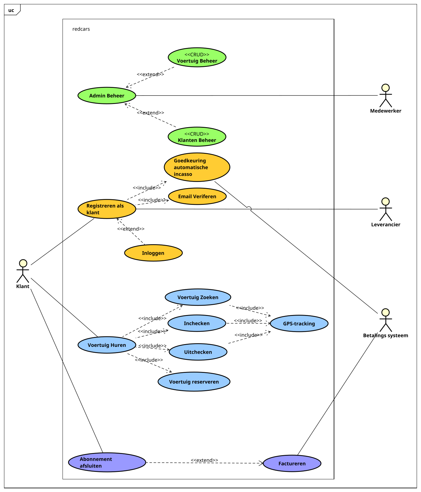

# Introductie

> Provide a short description of the software being specified and its purpose, including relevant benefits, objectives, and goals. If a separate description of the product scope is available (e.g. in the PvA), refer to it rather than duplicating its contents here.

## User Classes and Characteristics

> Identify the various user classes (actors) that you anticipate will use this product. User classes may be differentiated based on the subset of product functions used. Describe the pertinent characteristics of each user class. Certain requirements may pertain only to certain user classes.

## Operating Environment

> Describe the environment in which the software will operate, including the hardware platform, operating system and versions, and any other software components or applications with which it must peacefully coexist.

## Design and Implementation Constraints

> Describe any items or issues that will limit the options available to the developers. These might include: hardware (e.g. specific mobile platforms), specific technologies, tools, and databases to be used; interfaces to other applications; programming language required; or communications protocols

## Product Functions

> Summarize the major functions the product must perform or must let the user perform. Details will be provided in Section 3, so only a high level summary is needed here. In most cases, this section will primarily contain a use case diagram and brief use case descriptions

# Domain Model

> Provide a diagram showing important real-situation conceptual classes in the application domain. Do NOT include software classes. Describe each of the conceptual classes in a glossary.

# Usecase Model

## Brief Description

### Betalen

**Factureren** Een geregistreerde gebruiker krijgt periodiek een factuur als hij/ zei gekozen heeft voor een
betaald abonnement. De kosten van het factuur worden berekend aan de hand van welk abonnement de klant heeft,
hoeveel killometers er gereden zijn en hoe lang de auto gehuurd is. Sommige abonnementen hebben ook een aantal
vrije killometers, dit wordt dan ook meegenomen.

**abonnement afsluiten** Een geregistreerde gebruiker kiest een abonnement en sluit deze af.

### Huren

**GPS-Tracking** De meest recente locatie van ieder voertuig wordt herhaalijks opgeslagen in het systeem.

**Inchecken** Een gebruiker heeft een voertuig gereserveerd en checkt nu in bij een paal zodat deze gebruikt
kan worden.

**Voertuig reserveren** Een gebruiker is geregistreerd in het systeem en reserveert een voertuig zodat deze
gebruikt kan worden.

**Voertuig zoeken** Een gebruiker die in het systeem is geregistreerd zoekt naar een beschikbaar voertuig
dat in de buurt is.

**Uitchecken** Een gebruiker die ingecheckt heeft wilt nu uitchecken om te stoppen met het gebruiken
van het voertuig.

**Voertuig huren** Een gebruiker die geregistreerd is in het systeem huurt een voertuig om te gebruiken.

### Registreren

**Registreren als klant** De klant geeft zijn/ haar naam, woonplaats en adres op. Ook wordt er een e-mail adres
gevraagd en een bankrekeningnummer. Er wordt een goedkeuring gevraagd voor automatisch incasso, waarna er
een pas wordt verstuurd naar de klant waarmee er ingelogd kan worden.

**Email verifieren** Tijdens de registratie van een klant wordt de email geverifieerd, hierbij krijgt
de klant een e-mail met een verificatiecode die hij/ zei in de browser moet invullen.

**Goedkeuren automatisch incasso** Tijdens de registratie moet de gebruiker toestemming geven voor automatisch
incasso.

### Beheer

**Admin beheer** Het beheren van gegevens in het systeem.

**Voertuig beheer** Het beheren van gegevens van voertuigen.

**Klanten beheer** Het beheren van gegegens van klanten. Hierbij is het mogelijk dat een klant
inactief wordt gemaakt als gevolg van slechte betalingen of het verwaarlozen van voertuigen.

# Requirements

## (F)unctionality

1. Tijdens het registreren moet de naam, het adres en de woonplaats worden opgegeven door de klant.
1. Tijdens het registreren moet een e-mail adres worden opgegeven.
1. Tijdens het registreren moet het e-mail adres worden geverifieerd.
1. Tijdens het registreren moet een bankrekeningnummer worden opgegeven.
1. Tijdens het registreren moet er toestemming worden gevraagd voor automatische incasso.
1. Na het registreren moet een klantenpas worden opgestuurd naar de klant.
1. Na het gebruik van een voertuig moet er automatische incasso plaatsvinden.
1. Een klant moet in kunnen loggen op het systeem met het e-mail adres als gebruikersnaam en het pasnummer als wachtwoord.
1. Klanten moeten inactief kunnen worden gesteld door medewerkers indien er voertuigen gebrekkig achter zijn gelaten.
1. Klanten moeten enkel in de gereserveerde periode de auto kunnen meenemen.

## (R)eliability

1. Het niet mogelijk zijn om een auto te reserveren en in te checken zolang er een betalingsachterstand is.
1. Er moet een betalingsachterstand onstaan wanneer een automatische afschrijving mislukt
1. Het mag niet mogelijk zijn om op hetzelfde tijdstip meerdere malen ingecheckt te zijn.

## (U)sability

1. Klanten moeten snel kunnen zien welke voertuigen er beschikbaar zijn per stad, en waar deze staan.
1. Klanten moeten een auto kunnen reserveren.

## (P)erformance

1. Het systeem moet snel werken, zelfs wanneer er veel klanten tegelijkertijd aan het boeken zijn.

## (S)upportability

1. Medewerkers moeten klantgegevens aan kunnen passen en kunnen bekijken.
1. Medewerkers moeten voertuiggegevens aan kunnen passen en kunnen bekijken.

# Fully dressed usecases

## Registreren als klant

|                                                                                                               |                                                                                                                                             |
| ------------------------------------------------------------------------------------------------------------- | ------------------------------------------------------------------------------------------------------------------------------------------- |
| ^**Usecase**^                                                                                                 | Registreren als klant                                                                                                                       |
| ^**Primary actor**^                                                                                           | Klant                                                                                                                                       |
| ^**Stakeholders**^                                                                                            | Klant, Betalings systeem                                                                                                                    |
| ^**Preconditions**^                                                                                           | De klant is nog niet geregistreerd. De klant heeft een bank rekening dat werkt met het betalings systeem. De klant heeft een email account. |
| ^**Postconditions**^                                                                                          | De klant is geregistreerd en goedgekeurd.                                                                                                   |
| ^**Main success scenario**^                                                                                   |                                                                                                                                             |
| ^**Actor action**^                                                                                            | ^**System action**^                                                                                                                         |
| 1. De klant vraagt de registratie pagina op.                                                                  | 2. Het systeem toont de registratie pagina.                                                                                                 |
| 3. De klant voert zijn naam, emailadres, woon adres, woonplaats in en gaat akkoord met de voorwaarden         | 4. Het systeem maakt een nieuw (en onvolledig) account aan.                                                                                 |
|                                                                                                               | 5. De usecase "Email verifiëren" wordt afgetrapt.                                                                                           |
|                                                                                                               | 6. Het systeem stuurt de klant door naar een pagina van het betalingssysteem voor een goedkeuring van automatische incasso.                 |
| 7. De klant rond scenario van het betalingssysteem succesvol af.                                              |
| 8. De klant rond de usecase "Email verifiëren" af                                                             | 9. De kosten van de leverancier worden doorgevoerd naar de klant.                                                                           |
|                                                                                                               | 10. Het systeem registreert een nieuw pasje.                                                                                                |
|                                                                                                               | 11. Het systeem stuurt een order van een pasje naar de leverancier.                                                                         |
| ^**Alternative flow**^                                                                                        | Er is een fout met het opvragen van automatische incasso                                                                                    |
| ^**Actor action**^                                                                                            | ^**System action**^                                                                                                                         |
| 7. De klant rond het scenario van het betalingssysteem niet succesvol af.                                     | 8. Het systeem toont een foutmelding en toont een knop om stap 6 opnieuw uit te voeren.                                                     |
| ^**Alternative flow**^                                                                                        | Het afschrijven van de kosten van het pasje lukt niet                                                                                       |
| ^**Actor action**^                                                                                            | ^**System action**^                                                                                                                         |
|                                                                                                               | 9. Het systeem kan niet succesvol afschrijven.                                                                                              |
|                                                                                                               | 10. Het systeem toont een foutmelding en toont een knop om stap 6 opnieuw uit te voeren.                                                    |
| ^**Alternative flow**^                                                                                        | De klant maakt een fout tijdens het invlullen van gegevens                                                                                  |
| ^**Actor action**^                                                                                            | ^**System action**^                                                                                                                         |
| 3. De klant maakt een syntactische fout in zijn emailadres, woon adres, naam of acepteerd de voorwaarden niet | 4. Het systeem toont een foutmelding en laat de klant stap 3 opnieuw uitvoeren.                                                             |
| ^**Alternative flow**^                                                                                        | Het rekening nummer is al bekend in het systeem                                                                                             |
| ^**Actor action**^                                                                                            | ^**System action**^                                                                                                                         |
| 7. De klant rond scenario van het betalingssysteem succesvol af met een bestaand account.                     | 8. Het systeem toont een foutmelding en toont een knop om stap 6 opnieuw uit te voeren                                                      |

## Email veriferen

|                                        |                                                                                                           |
| -------------------------------------- | --------------------------------------------------------------------------------------------------------- |
| ^**Usecase**^                          | Email verifiëren                                                                                          |
| ^**Primary Actor**^                    | Klant                                                                                                     |
| ^**Stakeholders**^                     | Klant                                                                                                     |
| ^**Preconditions**^                    | De klant heeft een account (volledig of onvolledig). De email van het account is niet geverifeerd.        |
| ^**Postconditions**^                   | De email van het account is geverifeerd.                                                                  |
| ^**Main success scenario**^            |                                                                                                           |
| ^**Actor action**^                     | ^**System action**^                                                                                       |
| 1. De klant verstuurd een emailadres   | 2. Het systeem verstuurt een email met een link die een validatie token bevat, die voor 1 uur geldig is.. |
| 3. De klant klikt op de link           | 4. Het systeem markeert de email als gevalideerd                                                          |
| ^**Alternative flow**^                 | De link in de email is verlopen                                                                           |
| ^**Actor action**^                     | ^**System action**^                                                                                       |
| 3. De klant klikt op een verlopen link | 4. Het systeem toont een foutmelding en een knop die stap 2 opnieuw uitvoert.                             |

## Voertuig zoeken

|                                                                        |                                                                                                                                 |
| ---------------------------------------------------------------------- | ------------------------------------------------------------------------------------------------------------------------------- |
| ^**Usecase**^                                                          | Voertuig zoeken                                                                                                                 |
| ^**Primary Actor**^                                                    | Klant                                                                                                                           |
| ^**Stakeholders**^                                                     | Klant                                                                                                                           |
| ^**Preconditions**^                                                    | De klant is ingeloged met een geverifeerd account                                                                               |
| ^**Postconditions**^                                                   | Er is een voertuig geselecteerd (Deze is vrij op het moment van selecteren, maar het is niet gegarandeed dat deze vrij blijft). |
| ^**Main success scenario**^                                            |                                                                                                                                 |
| ^**Actor action**^                                                     | ^**System action**^                                                                                                             |
| 1. De klant geeft te kennen een voertuig te zoeken                     | 2. Het systeem toont de zoek pagina                                                                                             |
| 3. De klant vult een een locatie en maximale afstand van de locatie in | 4. Het systeem toont all voertuigen die aan de gegeven zoek parameters voldoen en niet gereserveerd zijn.                       |
| 5. De klant klikt op een voertuig                                      | 6. Het systeem toont het aangeklikte voertuig                                                                                   |
| 7. De klant klikt op selecteert voertuig.                              | 8. Het systeem selecteerd het voertuig                                                                                          |
| ^**Alternative flow**^                                                 | De klant wil een ander voertuig kiezen                                                                                          |
| 7. De klant klikt op de terug knop                                     | 8. Het systeem terug naar stap 4                                                                                                |
| ^**Alternative flow**^                                                 | De klant wil naar een ander voetuig zoeken                                                                                      |
| 5. De klant vult andere zoek parameters in                             | 8. Het systeem terug naar stap 4                                                                                                |
| ^**Alternative flow**^                                                 | Het kunnnen geen voertuigen gevonden worden                                                                                     |
|                                                                        | 4. Er zijn geen voertuigen gevonden.                                                                                            |
|                                                                        | 5. Toont een foutmelding en laat de klant stap 3 nog een keer uitvoeren                                                         |

## GPS tracking

|                                              |                                                              |
| -------------------------------------------- | ------------------------------------------------------------ |
| ^**Usecase**^                                | GPS Tracking                                                 |
| ^**Primary Actor**^                          | Voertuig                                                     |
| ^**Stakeholders**^                           | Voertuig                                                     |
| ^**Preconditions**^                          | Het voertuig is geauthentiseerd en verbonden met het systeem |
| ^**Postconditions**^                         | De locatie van het voertuig blijft (redelijk) up to date     |
| ^**Main success scenario**^                  |                                                              |
| ^**Actor action**^                           | ^**System action**^                                          |
| 1. Het voertuig stuurt de huidige locatie op | 2. Het systeem slaat de locatie op                           |
| 3. Het voertuig wacht 10 seconden            |                                                              |
| 4. Het voertuig gaat terug naar stap 1       |                                                              |

## Voertuig reserveren

|                                                                                                |                                                                                              |
| ---------------------------------------------------------------------------------------------- | -------------------------------------------------------------------------------------------- |
| ^**Usecase**^                                                                                  | Voertuig reserveren                                                                          |
| ^**Primary Actor**^                                                                            | Klant                                                                                        |
| ^**Stakeholders**^                                                                             | Klant, Betalings systeem                                                                     |
| ^**Preconditions**^                                                                            | De klant is ingelogged met een geverifeerd account.                                          |
| ^**Postconditions**^                                                                           | Er is een voertuig voor een bepaalde tijd gereserveerd. Er is een betaling overgemaakt.      |
| ^**Main success scenario**^                                                                    |                                                                                              |
| ^**Actor action**^                                                                             | ^**System action**^                                                                          |
| 1. De klant geeft te kennen een voertuig te reserveren.                                        | 2. Usecase "Voertuig zoeken" wordt successvol uitgevoerd.                                    |
| 3. De klant geeft aan hoe lang de reservering duurt                                            | 4. De prijs wordt berekend op basis van abonnement, voertuig, tijd en eventueel locatie.     |
|                                                                                                | 5. Het systeem toont een bevestigings popup met de totale (minimum) prijs.                   |
| 6. De klant gaat akkoord                                                                       | 7. Het systeem (atomisch) checkt en markeert het voertuig als gereserveerd.                  |
|                                                                                                | 8. Usecase "Factureren" wordt successvol uitgevoerd met de berekende prijs.                  |
| ^**Alternative flow**^                                                                         | De klant probeert een bezet voertuig te reserveren                                           |
| ^**Actor action**^                                                                             | ^**System action**^                                                                          |
|                                                                                                | 7. Het systeem komt er achter dat ondertussen iemand anders het voertuig heeft gereserveerd. |
|                                                                                                | 8. Het systeem toont een foutmelding en een knop om terug naar stap 2 te gaan.               |
| ^**Alternative flow**^                                                                         | De klant gaat niet akkoord met de voorwaarden                                                |
| ^**Actor action**^                                                                             | ^**System action**^                                                                          |
| 6. De klant gaat niet akkoord                                                                  | 7. Het systeem gaat terug naar stap 3                                                        |
| ^**Actor action**^                                                                             | ^**System action**^                                                                          |
|                                                                                                | 8. De usecase "Factureren" is niet succesvol uitgevoerd                                      |
|                                                                                                | 9. Het systeem markeert het voertuig als niet gereserveerd                                   |
|                                                                                                | 10. Het systeem toont een foutmelding en bied een knop om terug te gaan naar stap 3.         |
| ^**Alternative flow**^                                                                         | Het account van de klant is niet actief                                                      |
| ^**Actor action**^                                                                             | ^**System action**^                                                                          |
| 1. De klant met een inactief account geeft te kennen een voertuig te reserveren.               | 2. Het systeem toont een foutmelding met een knop om de achterstand te betalen               |
| ^**Alternative flow**^                                                                         | De klant probeert te reserveren terwijl er een adere reservering open staat                  |
| ^**Actor action**^                                                                             | ^**System action**^                                                                          |
| 1. De klant met een andere openstaande reservering geeft te kennen een voertuig te reserveren. | 2. Het systeem toont een foutmelding.                                                        |

## Inchecken

|                                           |                                                                                                                            |
| ----------------------------------------- | -------------------------------------------------------------------------------------------------------------------------- |
| ^**Usecase**^                             | Inchecken                                                                                                                  |
| ^**Primary Actor**^                       | Klant                                                                                                                      |
| ^**Stakeholders**^                        | Klant                                                                                                                      |
| ^**Preconditions**^                       | De klant heeft een pas met een geverifeerd account.                                                                        |
| ^**Postconditions**^                      | De kilometer stand is opgeslagen. Het voertuig wordt gemarkeerd als in gebruik. Het station is ontkoppeld aan het voertuig |
| ^**Main success scenario**^               |                                                                                                                            |
| ^**Actor action**^                        | ^**System action**^                                                                                                        |
| 1. Een klant houd het pasje bij het slot. | 2. Het voertuig verifeerd het verzoek als geldig                                                                           |
|                                           | 3. Het voertuig gaat open                                                                                                  |
|                                           | 4. Het voertuig staat het aanzetten van de motor toe.                                                                      |
|                                           | 5. Het voertuig wordt gemarkeerd als in gebruik samen met de huidige kilometerstand en het station woordt ontkoppeld       |
| ^**Alternative flow**^                    | De klant probeert in te checken met een pasje dat niet gekoppeld is aan de reservering                                     |
| ^**Actor action**^                        | ^**System action**^                                                                                                        |
|                                           | 2. Het voertuig verifeert het verzoek als ongeldig omdat het pas nummer niet matchet met de huidige reservering            |
|                                           | 3. Het gelinkte station knippert 3 seconden rood.                                                                          |
| ^**Alternative flow**^                    | De klant probeert in te checken met een inactief account                                                                   |
| ^**Actor action**^                        | ^**System action**^                                                                                                        |
|                                           | 2. Het voertuig verifeert het verzoek als ongeldig omdat het account inactief is.                                          |
|                                           | 3. Het gelinkte station knippert 3 seconden rood.                                                                          |

## Uitchecken

|                                                              |                                                                                                                                             |
| ------------------------------------------------------------ | ------------------------------------------------------------------------------------------------------------------------------------------- |
| ^**Usecase**^                                                | Uitchecken                                                                                                                                  |
| ^**Primary Actor**^                                          | Klant                                                                                                                                       |
| ^**Stakeholders**^                                           | Klant                                                                                                                                       |
| ^**Preconditions**^                                          | De klant heeft een pas met een geverifeerd account.                                                                                         |
| ^**Postconditions**^                                         | Het voertuig wordt gemarkeerd als niet in gebruik. Het station is gekoppeld aan het voertuig.                                               |
| ^**Main success scenario**^                                  |                                                                                                                                             |
| ^**Actor action**^                                           | ^**System action**^                                                                                                                         |
| 1. De klant zet de motor stil en doet de deur open.          | 2. Usecase "GPS tacking" wordt succesvol uitgevoerd.                                                                                        |
|                                                              | 3. Het systeem detecteert dat het voertuig zich binnen 5 meter van een station bevind                                                       |
|                                                              | 4. Het systeem verifeerd dat het station niet het voertuiglimiet heeft bereikt                                                              |
|                                                              | 5. Het voertuig blokkeert het aanzetten van de motor.                                                                                       |
|                                                              | 6. Het systeem koppelt het station aan het voertuig                                                                                         |
|                                                              | 7. Het systeem zet het licht van het station en voertuig op rood.                                                                           |
| 8. De klant houdt zijn pasje tegen het slot van het voertuig | 9. Het voertuig gaat op slot.                                                                                                               |
|                                                              | 10. Het licht van het station en voertuig gaan uit.                                                                                         |
|                                                              | 11. Het voertuig wordt gemarkeerd als niet in gebruik samen met de huidige kilometerstand.                                                  |
|                                                              | 12. Usecase "Factureren" wordt afgetrapt met een bedrag op basis van voertuig en kilometers gereden en (optineel) te laat uitgechecte tijd. |
| ^**Alternative flow**^                                       | De klant overschijd het voertuig limiet van het station                                                                                     |
| ^**Actor action**^                                           | ^**System action**^                                                                                                                         |
|                                                              | 4. Het systeem detecteert dat het voertuiglimiet is bereikt.                                                                                |
|                                                              | 5. Het station zet rood ligt aan voor 5 seconden                                                                                            |
| ^**Alternative flow**^                                       | De klant probeert in te checken met een pasje dat niet gekoppeld is aan de reservering                                                      |
| ^**Actor action**^                                           | ^**System action**^                                                                                                                         |
|                                                              | 2. Het voertuig verifeert het verzoek als ongeldig omdat het pas nummer niet matchet met de huidige reservering                             |
|                                                              | 3. Het gelinkte station knippert 3 seconden rood.                                                                                           |
|                                                              |

## Factureren

|                               |                                                                                                                    |
| ----------------------------- | ------------------------------------------------------------------------------------------------------------------ |
| ^**Usecase**^                 | Factureren                                                                                                         |
| ^**Primary Actor**^           | Klant                                                                                                              |
| ^**Stakeholders**^            | Klant, Betalingssysteem                                                                                            |
| ^**Preconditions**^           | De klant heeft een account.                                                                                        |
| ^**Postconditions**^          | Een geld transactie is afgehandeld                                                                                 |
| ^**Main success scenario**^   |                                                                                                                    |
| ^**Actor action**^            | ^**System action**^                                                                                                |
|                               | 1. Het systeem stuurt een bericht naar het betaal systeem om geld af te schrijven                                  |
|                               | 2. Het systeem krijgt een bericht binnen dat het geld successvol is afgeschreven                                   |
| ^**Alternative flow**^        | Het geld kan niet afgeschreven worden.                                                                             |
| ^**Actor action**^            | ^**System action**^                                                                                                |
|                               | 2. Het systeem krijgt een beright dat het geld niet afgeschreven kan worden                                        |
|                               | 3. Het systeem zet het bedrag als schuld op het account.                                                           |
|                               | 4. Het systeem markeert het account als inactief                                                                   |
|                               | 5. Het systeem stuurt een email waar de klant een link krijgt om de schuld af te betalen via het betalings systeem |
| 6. De klant betaalt de schuld | 7. Het systeem haalt de schuld af van het account.                                                                 |
|                               | 8. Het systeem markeert het acccount als actief.                                                                   |

## Abbonnement afsluiten

|                                                                                              |                                                                                             |
| -------------------------------------------------------------------------------------------- | ------------------------------------------------------------------------------------------- |
| ^**Usecase**^                                                                                | \<CRUD\> Klanten beheer - Klant selecteren                                                  |
| ^**Primary actor**^                                                                          | Medewerker                                                                                  |
| ^**Stakeholders**^                                                                           | \-                                                                                          |
| ^**Preconditions**^                                                                          | De medewerker is ingelogd in het systeem                                                    |
| ^**Postconditions**^                                                                         | Er is een klant geselecteerd                                                                |
| ^**Main success scenario**^                                                                  | De medewerker zoekt een klant en kan deze vinden                                            |
| ^**Actor action**^                                                                           | ^**System action**^                                                                         |
| 1. Een medewerker geeft te kennen een klant op te willen zoeken                              | 2. Het systeem presenteert de pagina waar klanten gezocht kunnen worden                     |
|                                                                                              | 4. Het systeem haalt de lijst van klanten op                                                |
| 3. De medewerker vult een zoekopdracht in op basis van een adres, naam, email of klantnummer | 5. Het systeem presenteert een lijst van gevonden klanten                                   |
| 6. De medewerker selecteert een van de klanten                                               | 7. Het systeem haalt de klantgegevens op                                                    |
|                                                                                              | 8. Het systeem presenteert de gegevens van de klant samen met de mogelijke opties           |
| ^**Alternative flow**^                                                                       | ^**Geen klanten gevonden**^                                                                 |
|                                                                                              | 5a. Het systeem toont een melding om aan te geven dat geen klanten gevonden zijn            |
| ^**Alternative flow**^                                                                       | ^**Geselecteerde klant bestaat niet meer**^                                                 |
|                                                                                              | 8b. Het systeem toont een melding om aan te geven dat de klant verwijderd is na het zoeken. |

|                                                                 |                                                                                                 |
| --------------------------------------------------------------- | ----------------------------------------------------------------------------------------------- |
| ^**Usecase**^                                                   | \<CRUD\> Klanten beheer - Klant verwijderen                                                     |
| ^**Primary actor**^                                             | Medewerker                                                                                      |
| ^**Stakeholders**^                                              | Klant                                                                                           |
| ^**Preconditions**^                                             | De medewerker heeft een klant geselecteerd                                                      |
| ^**Postconditions**^                                            | De klant is verwijderd uit het systeem                                                          |
| ^**Main success scenario**^                                     | De medewerker verwijderd een klant                                                              |
| ^**Actor action**^                                              | ^**System action**^                                                                             |
| 1. De medewerker geeft te kennen de klant te willen verwijderen | 2. Het systeem vraagt de medewerker om het verwijderen te bevestigen                            |
| 3. De medewerker bevestigd het verwijderen van de klant         | 4. Het systeem verwijderd de klant                                                              |
|                                                                 | 5. Het systeem presenteert een melding om aan te geven dat de klant verwijderd is               |
| ^**Alternative flow**^                                          | ^**De medewerker bevestigd het verwijderen van de klant niet**^                                 |
| 3a. De medewerker bevestigd het verwijderen van de klant niet   | 3b. Het systeem verwijderd de klant niet                                                        |
| ^**Alternative flow**^                                          | ^**Klant kon niet worden verwijderd**^                                                          |
|                                                                 | 5b. Het systeem presenteert een melding om aan te geven dat de klant niet kon worden verwijderd |

|                                                                                    |                                                                                                  |
| ---------------------------------------------------------------------------------- | ------------------------------------------------------------------------------------------------ |
| ^**Usecase**^                                                                      | \<CRUD\> Klanten beheer - Klant inactief stellen                                                 |
| ^**Primary actor**^                                                                | Medewerker                                                                                       |
| ^**Stakeholders**^                                                                 | Klant                                                                                            |
| ^**Preconditions**^                                                                | De medewerker heeft een klant geselecteerd                                                       |
| ^**Postconditions**^                                                               | De geselecteerde klant is inactief gesteld                                                       |
| ^**Main success scenario**^                                                        | De medewerker stelt de geselecteerde klant inactief                                              |
| ^**Actor action**^                                                                 | ^**System action**^                                                                              |
| 1. De medewerker geeft te kennen de geselecteerde klant inactief te willen stellen | 2. Het systeem vraagt de gebruiker om het inactief stellen te bevestigen                         |
| 3. De medewerker beslist om wel of niet te bevestigen.                             | 4. Het systeem stelt de klant inactief                                                           |
|                                                                                    | 5. Het systeem toont een melding dat de klant inactief is gesteld                                |
| ^**Alternative flow**^                                                             | ^**De medewerker bevestigd het inactief stellen niet**^                                          |
|                                                                                    | 4a. Het systeem stelt de gebruiker niet inactief                                                 |
| ^**Alternative flow**^                                                             | ^**De klant kan niet inactief worden gesteld**^                                                  |
|                                                                                    | 5b. Het systeemt toont een melding om aan te geven dat de klant niet inactief gesteld kan worden |

|                                                                              |                                                                               |
| ---------------------------------------------------------------------------- | ----------------------------------------------------------------------------- |
| ^**Usecase**^                                                                | \<CRUD\> Klanten beheer - Gegevens van klant aanpassen                        |
| ^**Primary actor**^                                                          | Medewerker                                                                    |
| ^**Stakeholders**^                                                           | Klant                                                                         |
| ^**Preconditions**^                                                          | De medewerker heeft een klant geselecteerd                                    |
| ^**Postconditions**^                                                         | De gegevens van de klant zijn aangepast                                       |
| ^**Main success scenario**^                                                  | De past de gegevens van de klant aan                                          |
| ^**Actor action**^                                                           | ^**System action**^                                                           |
| 1. De medewerker geeft te kennen de geselecteerde klant aan te willen passen | 2. Het systeem presenteert een pagina waarin gegevens aangepast kunnen worden |
| 3. De medewerker past de gegevens aan in de pagina                           | 4. Het systeem valideert de gegeven aanpassingen                              |
